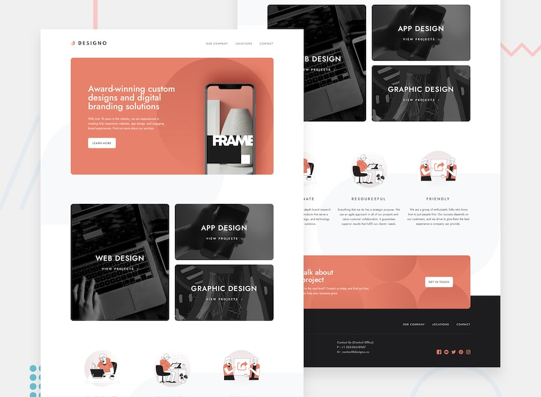

# Frontend Mentor - Designo agency website solution

This is a solution to the [Designo agency website challenge on Frontend Mentor](https://www.frontendmentor.io/challenges/designo-multipage-website-G48K6rfUT). Frontend Mentor challenges help you improve your coding skills by building realistic projects.

## Table of contents

- [Overview](#overview)
  - [The challenge](#the-challenge)
  - [Screenshot](#screenshot)
  - [Links](#links)
- [My process](#my-process)
  - [Built with](#built-with)
  - [What I learned](#what-i-learned)
- [Author](#author)

**Note: Delete this note and update the table of contents based on what sections you keep.**

## Overview

### The challenge

Users should be able to:

- View the optimal layout for each page depending on their device's screen size
- See hover states for all interactive elements throughout the site
- Receive an error message when the contact form is submitted if:
  - The `Name`, `Email Address` or `Your Message` fields are empty should show "Can't be empty"
  - The `Email Address` is not formatted correctly should show "Please use a valid email address"

### Screenshot



### Links

- Live Site URL: [Live site](https://designo-site.netlify.app)

## My process

### Built with

- [Gatsby](https://gatsbyjs.com/) - React framework
- [Styled Components](https://styled-components.com/) - For styles
- [MDX Markdown](https://mdxjs.com)
- Flexbox
- CSS Grid
- Mobile-first workflow

### What I learned

- Learnt how to use the background-position to position a background image
- Learnt how to createpages dynamically in Gatsby
- Learnt how to query data from the Gatsby data layer with graphql
- Learnt how to use Markdown
- Learnt how to display different images on different viewport with the picture tag

```html
<picture>
  <source media="(min-width: 1024px)" srcset="desktopImg" />
  <source media="(min-width: 768px)" srcset="tabletImg" />
  
</picture>
```

## Author

- Frontend Mentor - [@godwinopara](https://www.frontendmentor.io/profile/godwinopara)
- Twitter - [@godwinopara12](https://www.twitter.com/godwinopara12)
